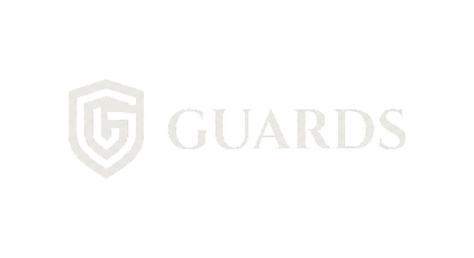
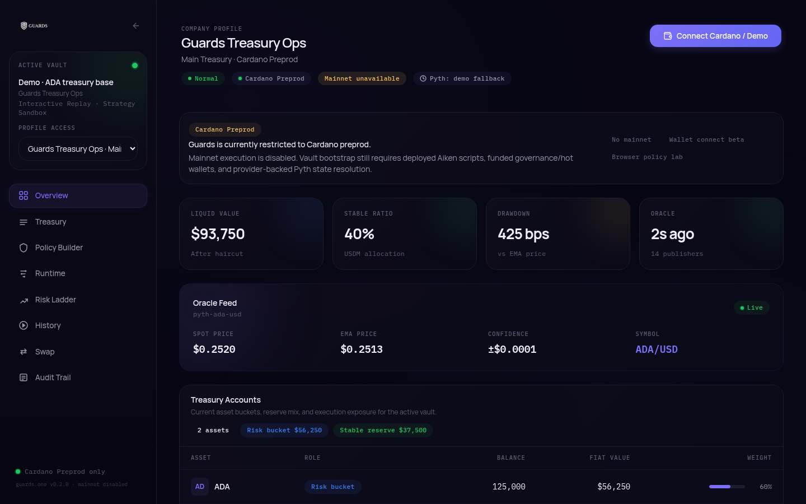
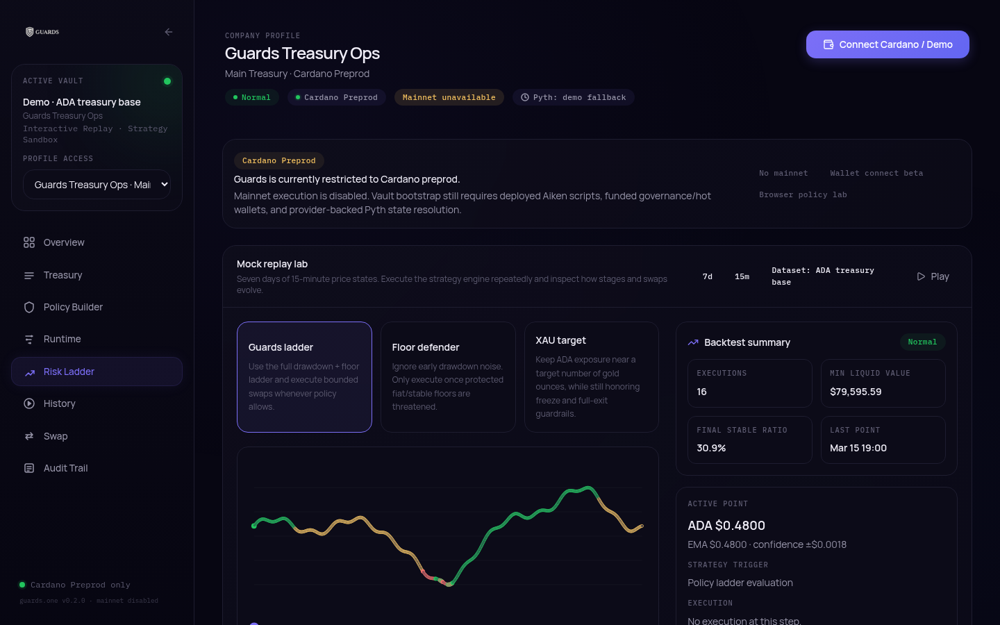

<p align="center">
  
</p>

<p align="center"><strong>Oracle-aware treasury risk dashboard for multichain DAOs, built on Pyth price feeds.</strong></p>

<p align="center">
  Guards turns a treasury's risk mandate into a policy engine: it reads oracle data, measures drawdown against absolute fiat floors, and moves the treasury through a risk ladder of bounded, auditable protective swaps.
</p>

<p align="center">
  
</p>

---

## Built at Pythathon Buenos Aires

Guards was built for **Pythathon**, the Pyth Network hackathon held in Buenos Aires in March 2026.

**Built by Nico Fernandez ([@f0x1777](https://github.com/f0x1777)) and Kevin Anrique ([@kevan1](https://github.com/kevan1)).**

> **About this repository.** This is the **frontend-only showcase** of Guards: the Next.js operator dashboard and landing page, extracted so it runs on its own. The full system (shared policy engine packages, backend collector / risk engine / keeper, Cardano off-chain tooling and Aiken contract scaffold) lives in a private repository.
>
> **Everything in this UI runs on simulated data.** Balances, executions, audit events and the replay datasets are bundled demo fixtures. No wallet, backend or API key is required, and no transactions are ever sent.

## The problem

DAO treasuries usually write their mandates as percentages, but the real failure mode is breaching an **absolute, fiat-denominated floor**. When markets move fast, coordinating a multisig by hand is too slow to protect value. Most treasury tooling either tracks prices passively or needs a human at every step.

Guards turns those rules into executable policy:

1. Ingest oracle snapshots from Pyth.
2. Evaluate treasury health using drawdown, liquid value, oracle confidence and freshness.
3. Authorize a bounded execution intent that carries the oracle evidence.
4. Execute an approved route from a capped execution wallet (never from the governance multisig).
5. Record an audit trail with the intent, the result and the oracle context.

## What the demo shows

Open the landing page, then **Open Demo** to reach the operator dashboard (`/dashboard`).

| Section | What you see |
|---|---|
| **Overview** | Company/vault profile, liquid value after haircut, stable ratio, drawdown vs EMA price, oracle freshness and the current Pyth feed snapshot (`price`, `emaPrice`, `confidence`). |
| **Treasury** | Risk bucket and stable reserve accounts with balances, fiat value and weights. |
| **Policy Builder** | A browser-side vault bootstrap lab: pick a company profile, reference asset and custody mode, tune thresholds and floors, and run scenarios against the policy engine. |
| **Runtime** | Switch between *mock replay* datasets and a *preprod snapshot* view. |
| **Risk Ladder** | The risk ladder plus a **mock replay lab**: 7 days of 15-minute price points replayed through the strategy engine (Guards ladder, Floor defender, XAU target) over datasets such as ADA treasury base, ADA flash crash, stable depeg and XAU rotation, with a backtest summary and per-step explanations. |
| **History / Swap / Audit Trail** | Simulated protective swaps (de-risk, re-entry), a swap panel, and audit cards for each execution. |

The dashboard opens with a "Cardano preprod only" notice carried over from the original product: mainnet execution was intentionally disabled in the hackathon build.

<p align="center">
  
</p>

### Risk ladder

| Stage | Trigger | Action |
|---|---|---|
| **Normal** | Drawdown below the watch threshold | Hold allocation, monitor feeds |
| **Watch** | Drawdown > `watchDrawdownBps` | Increase monitoring, prepare routes |
| **Partial de-risk** | Drawdown > `partialDrawdownBps` | Swap part of the risk asset into the approved stable |
| **Full stable exit** | Drawdown > `fullExitDrawdownBps` or floor breached | Exit the remaining risk bucket into stable |
| **Frozen** | Oracle stale or confidence too wide | Block execution until data quality recovers |
| **Auto re-entry** | Recovery past `reentryDrawdownBps` and cooldown elapsed | Restore risk allocation gradually |

The engine measures both percentage drawdown and absolute protected value:

```text
liquid_value = amount × pyth_price × (1 − haircut_bps / 10000)
```

So it reacts not only to "the asset dropped X%", but also to "the treasury fell below the fiat floor we promised to defend".

## How Guards uses Pyth

In the Guards design, Pyth is a core dependency of the policy engine, not a cosmetic price ticker:

| Pyth signal | How Guards uses it |
|---|---|
| `price` | Spot valuation for liquid-value calculations |
| `emaPrice` | Baseline for drawdown measurement |
| `confidence` | A widening confidence interval can freeze execution |
| freshness (update timestamp) | Stale data blocks execution |
| snapshot IDs | Carried into the audit trail for verification |

In **this frontend repository** specifically:

- The dashboard, replay lab and policy views run on bundled demo snapshots shaped like Pyth updates (`price`, `emaPrice`, `confidence`, `publisherCount`, update time).
- Two optional server routes, `/api/oracle/quotes` (ADA, XAU, BTC, SOL, EUR vs USD) and `/api/oracle/primary` (ADA/USD by default), use the [`@pythnetwork/pyth-lazer-sdk`](https://www.npmjs.com/package/@pythnetwork/pyth-lazer-sdk) to fetch the latest Pyth Lazer prices **only if** you set `PYTH_API_KEY`. Without it they return `503` and the UI stays on demo data (the top bar shows `Pyth: demo fallback`).

The signed-update collector, the Cardano witness wiring and the keeper that acted on these signals are part of the private repository and are not included here.

## Multichain status (at the end of the hackathon)

| Chain | Status |
|---|---|
| **Cardano** | MVP in progress: policy engine, PolicyVault simulator, Aiken scaffold, DexHunter / Minswap execution path in progress |
| **Solana (SVM)** | Connector scaffold, Pyth-native target |
| **Ethereum (EVM)** | Connector scaffold, Pyth EVM target |

The policy engine is shared across chains; execution stays local to each connected treasury.

## Tech stack

- [Next.js 16](https://nextjs.org/) (App Router, Turbopack) and React 19
- TypeScript 5
- Tailwind CSS 4
- Framer Motion, lucide-react, hls.js (landing background video)
- `@pythnetwork/pyth-lazer-sdk` (optional live quotes)
- Vitest for the `lib/` unit tests

## Run locally

Requires **Node.js 24** or newer (see `.nvmrc` and `engines`).

```bash
git clone https://github.com/kevan1/guards-ui.git
cd guards-ui
npm install
npm run dev          # http://localhost:3000
```

Other scripts:

```bash
npm run build        # production build
npm start            # serve the production build
npm run typecheck    # tsc --noEmit
npm test             # vitest (policy engine / replay / price helpers)
```

### Optional: live Pyth quotes

No environment variables are needed. To try the live quote routes, copy `.env.example` to `.env.local` and set `PYTH_API_KEY` to a Pyth Lazer access token. It is read only on the server and is never sent to the browser.

## Deploy to Vercel

The repository root is the Next.js app, so importing it needs no special configuration:

| Setting | Value |
|---|---|
| Framework preset | Next.js |
| Root directory | `./` (repository root) |
| Install command | `npm ci` (from `vercel.json`) |
| Build command | `npm run build` (from `vercel.json`) |
| Output directory | default (`.next`) |
| Node.js version | 24.x |
| Environment variables | none required; `PYTH_API_KEY` optional |

## Project structure

```text
app/                 Next.js routes: landing (/), dashboard (/dashboard), api/oracle/*
components/          Dashboard panels and landing sections
lib/                 Demo data, policy/vault lab, mock backtest engine, types
lib/core-types.ts    Domain types vendored from the private core package
public/              Logos and images
docs/                Screenshots
```

## License

The original project is "All rights reserved" and this repository does not include an open-source license. It is published as a hackathon showcase. Contact the authors for licensing questions.
